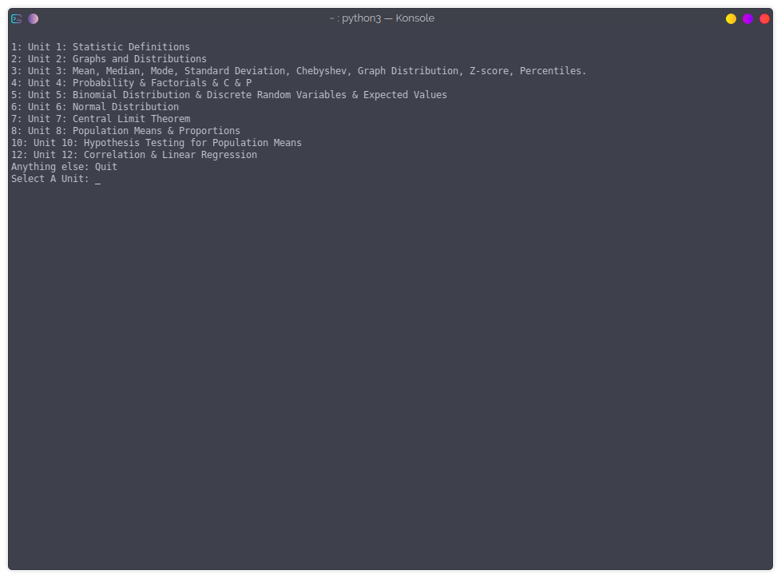

# StatisticTool
A Python-based Statistics Tool with an Interface that could bring every designer to tears

# Dependencies
* PIP
* NumPy
* SciPy
* Python 3.7+
* Frac

# Installation Instructions
* Clone Repository
* Add Python Interpreter
* Install dependencies
* Run main.py
